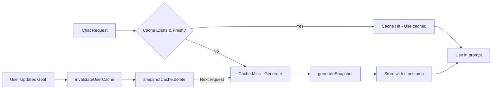

# AI Orchestrator — Architecture Documentation

The orchestrator is MentalAI's AI pipeline that processes every chat message, loads user context, determines conversation state, builds prompts, and manages the AI response flow.

## Table of Contents

- [Overview](#overview)
- [Pipeline Flow](#pipeline-flow)
- [Context Sources](#context-sources)
- [Prompt Construction](#prompt-construction)
- [Session State Management](#session-state-management)
- [Module Roles](#module-roles)
- [Cache Invalidation](#cache-invalidation)

## Overview

**Entry Point:** `src/lib/ai/orchestrator/index.ts`

The orchestrator implements an 8-step pipeline that:
1. Creates/loads conversation
2. Runs safety checks (crisis detection, moderation)
3. Analyzes emotion
4. Loads user context (profile, memory, life context, conversation history)
5. Determines conversation state
6. Builds LifeSnapshot and inference confidence
7. Constructs dynamic prompt
8. Calls LLM and validates response

## Pipeline Flow

```mermaid
flowchart TB
    Start[User sends message] --> API[/api/chat route]
    API --> Auth{Auth Check}
    Auth -->|Valid| Orch[orchestrateStreaming]
    
    Orch --> Conv[Create/Load Conversation]
    Conv --> Safety[Safety Engine]
    Safety --> Emotion[Emotion Engine]
    
    Emotion --> LoadContext[Load Context - Promise.all]
    LoadContext --> Profile[profiles table]
    LoadContext --> Memory[match_memories RPC]
    LoadContext --> LifeCtx[get_life_context RPC]
    LoadContext --> History[messages history]
    
    Profile --> StateMachine[State Machine]
    Memory --> StateMachine
    LifeCtx --> StateMachine
    History --> StateMachine
    
    StateMachine --> Snapshot[Build LifeSnapshot]
    Snapshot --> Cache{Cache Valid?}
    Cache -->|Yes| CachedSnap[Return cached]
    Cache -->|No| GenSnap[Generate fresh]
    
    GenSnap --> StoreCache[Store in Map - 5min TTL]
    StoreCache --> BuildPrompt[Build Dynamic Prompt]
    CachedSnap --> BuildPrompt
    
    BuildPrompt --> LLM[Call LLM Streaming]
    LLM --> Validate[Response Validation]
    Validate --> Stream[Stream to Client]
    
    Stream --> Background[Background Tasks]
    Background --> Extract[Extract Life Data]
    Background --> StoreMem[Store Memory]
    Background --> Summarize[Summarize Session]
    
    Extract --> Invalidate[Invalidate Cache]
    StoreMem --> Invalidate
    
    style LoadContext fill:#e1f5ff,stroke:#0288d1
    style Snapshot fill:#fff3e0,stroke:#f57c00
    style BuildPrompt fill:#e8f5e9,stroke:#388e3c
    style Invalidate fill:#ffebee,stroke:#d32f2f
```

## Context Sources

### Single Source of Truth Pattern

All parts of the system load context from the same sources to ensure consistency. The orchestrator loads context **once per message** in parallel:

```typescript
const [historyResult, memory, profileResult, lifeContext] = await Promise.all([
  // Conversation history (last 30 messages)
  serviceClient.from("messages").select("role, content")
    .eq("conversation_id", conversationId)
    .order("created_at", { ascending: true })
    .limit(30),
  
  // Vector memory (pgvector RAG retrieval)
  getMemoryContext(userId, input.message),
  
  // User profile
  serviceClient.from("profiles").select("full_name, vision")
    .eq("id", input.userId)
    .single(),
  
  // Structured life context (goals, tasks, commitments)
  getLifeContext(input.userId).catch(() => null),
]);
```

### Context Components

| Component | Source | Purpose | Cache Strategy |
|-----------|--------|---------|----------------|
| **Profile** | `profiles` table | User identity, vision, coaching style | No cache (fast query) |
| **Memory** | `match_memories` RPC + pgvector | Long-term memory, past conversations | No cache (semantic search) |
| **Life Context** | `get_life_context` RPC | Goals, tasks, commitments, accountability | No cache (fresh data) |
| **History** | `messages` table | Last 30 messages of conversation | No cache (conversation state) |
| **LifeSnapshot** | Generated from above | Compact operating state summary | **5-min in-memory cache** |

### Why LifeSnapshot is Cached

The LifeSnapshot is a compact summary of the user's operating state (identity, focus, goals, momentum). It's generated from the full context but cached because:

1. **Performance:** Generating it is expensive (multiple computations)
2. **Consistency:** Same snapshot should be used within a 5-minute window
3. **Stability:** Prevents churn from minor context changes

**Cache invalidation:** Automatically cleared when user data changes (goals, tasks, commitments, memory writes).

## Prompt Construction

Prompts are built dynamically in `prompt-builder.ts` by layering context:

```
┌─────────────────────────────────────────────────┐
│ SYSTEM_PROMPT (base mentor identity)           │
├─────────────────────────────────────────────────┤
│ User Profile (name, vision, founder mode)      │
├─────────────────────────────────────────────────┤
│ Conversation State Instructions (LISTENING, etc)│
├─────────────────────────────────────────────────┤
│ Emotional Regulation Guidance                   │
├─────────────────────────────────────────────────┤
│ Full Life Context (goals, tasks, commitments)  │
├─────────────────────────────────────────────────┤
│ Context Confidence Alert (LOW/MODERATE/HIGH)   │
├─────────────────────────────────────────────────┤
│ LifeSnapshot (compact operating state)         │
├─────────────────────────────────────────────────┤
│ Inference Guidance (for inferred data)         │
├─────────────────────────────────────────────────┤
│ Current Emotion Analysis                        │
├─────────────────────────────────────────────────┤
│ Vector Memory (formatted narratively)          │
├─────────────────────────────────────────────────┤
│ Safety Warnings (if crisis/high-risk)          │
├─────────────────────────────────────────────────┤
│ Last 20 Messages + Current User Message        │
└─────────────────────────────────────────────────┘
```

### Context Injection Points

**Main Chat Flow:** Uses full `buildPrompt()` stack (all layers above)

**Secondary LLM Calls:** Lightweight, focused prompts:
- **Emotion Detection:** Inline prompt in `emotion-engine.ts` (runs before main context load)
- **Extraction:** `EXTRACTION_PROMPT` from `prompts.ts` (background task after response)
- **Summarization:** Inline prompt in `memory-engine.ts` (background task)

This separation is intentional: secondary calls don't need full context.

## Session State Management

### Session Context Injection (Frozen Snapshot Pattern)

At the start of every session (chat message), the orchestrator loads the user's complete context. This ensures the AI "knows" the user immediately without re-asking.

**Implementation:**
```typescript
// After context is loaded (index.ts, line ~243)
const lifeSnapshot = getLifeSnapshot(input.userId, lifeContext, user, memory);
const inferenceConfidence = computeInferenceConfidence(contextRichness, lifeContext, memory, user);

// Logging for observability
console.log("[Session Context]", {
  userId,
  conversationId,
  hasLifeContext: !!lifeContext,
  memoryCount: memory.longTerm.length + memory.episodic.length,
  snapshotAge: lifeSnapshot.snapshotAge,
  contextRichness: contextRichness.level,
  inferenceConfidence: inferenceConfidence.overall,
});
```

### Session Continuity Guarantee

The system ensures returning users never start with a "blank slate":

1. **User declares goal:** "I want to build a SaaS"
2. **Background extraction:** Goal is stored in `goals` table
3. **Cache invalidated:** LifeSnapshot cache is cleared
4. **Next session:** User returns, asks "What should I focus on?"
5. **Context loaded:** Orchestrator loads goal from DB
6. **AI responds:** References SaaS goal without re-asking

### New User vs Returning User

**New User (no data):**
- LifeSnapshot: identity="unknown", activeGoalTitles=[]
- Context Richness: LOW
- AI behavior: Asks orienting questions, doesn't hallucinate

**Returning User (has goals/tasks):**
- LifeSnapshot: identity="founder", activeGoalTitles=["Build SaaS"]
- Context Richness: MODERATE or HIGH
- AI behavior: References known context, gives specific advice

## Module Roles

| Module | Purpose | Used By |
|--------|---------|---------|
| `index.ts` | Main orchestration pipeline | `/api/chat` route |
| `prompt-builder.ts` | Dynamic prompt construction | `index.ts` |
| `snapshot-engine.ts` | LifeSnapshot generation & caching | `index.ts` |
| `memory-engine.ts` | Vector memory retrieval & storage | `index.ts`, background tasks |
| `accountability-engine.ts` | Life context (goals/tasks) loading | `index.ts` |
| `emotion-engine.ts` | Emotion analysis | `index.ts` (pre-context) |
| `safety-engine.ts` | Safety checks | `index.ts` (first step) |
| `state-machine.ts` | Conversation state determination | `index.ts` |
| `router.ts` | LLM model selection & calling | All engines |
| `extraction-engine.ts` | Background life data extraction | `index.ts` (post-response) |
| `context-richness-engine.ts` | Context level computation | `index.ts` |
| `response-validator.ts` | Response safety validation | `index.ts` |
| `style-validator.ts` | Anti-hallucination style checks | `index.ts` |
| `cache-invalidation.ts` | Cache invalidation utility | API routes |

### Unused Modules (Documented)

| Module | Status | Action |
|--------|--------|--------|
| `planning-engine.ts` | Not called from orchestrator | Can be removed or wired to separate planning API |
| `insight-engine.ts` | Not imported anywhere | Can be removed or integrated for emotional insights |

## Cache Invalidation

### The Problem

User updates goals via dashboard → LifeSnapshot cache is stale → AI gives advice based on outdated context.

### The Solution

**Automatic invalidation on write:**

```typescript
// After any mutation that changes user context
import { invalidateUserCache } from "@/lib/ai/orchestrator/cache-invalidation";

// In API routes
await supabase.from("goals").insert(newGoal);
invalidateUserCache(user.id, "goal created");
```

### Invalidation Points

| Event | Location | Reason |
|-------|----------|--------|
| Goal created/updated/deleted | `src/app/api/goals/route.ts` | Goals affect snapshot focus, momentum |
| Task created/updated/deleted | `src/app/api/tasks/route.ts` | Tasks affect accountability items |
| Memory written | `src/lib/ai/orchestrator/memory-engine.ts` | Memory affects identity, patterns |
| Memory compressed | `src/lib/ai/orchestrator/memory-engine.ts` | Memory structure changed |
| Background extraction completes | `src/lib/ai/orchestrator/index.ts` | New goals/commitments extracted |

### Cache Lifecycle



## Testing

### Unit Tests

- `tests/unit/snapshot-engine.test.ts` - LifeSnapshot generation & caching

### Integration Tests

- `tests/integration/cache-invalidation.test.ts` - Cache invalidation on mutations
- `tests/integration/session-continuity.test.ts` - Context persistence across sessions

### E2E Tests

- `tests/e2e/returning-user.spec.ts` - Complete user journey with Playwright

Run tests:
```bash
npm test                  # Unit & integration
npm run test:ui           # Vitest UI
npm run test:e2e          # E2E with Playwright
```

## Best Practices

### When Adding New User Data

1. **Store in database** (e.g., new `routines` table)
2. **Add to `get_life_context` RPC** (if structured data)
3. **Update LifeContext type** in `types.ts`
4. **Wire to snapshot generation** if it affects focus/momentum
5. **Add cache invalidation** to mutation endpoints
6. **Test session continuity**

### When Adding New AI Calls

1. **Decide if it needs full context** (most don't)
2. **If full context:** Use `buildPrompt()` pattern
3. **If lightweight:** Create focused inline prompt
4. **If it writes data:** Add cache invalidation after write
5. **Log the call** for observability

### When Debugging Context Issues

Check logs for:
```
[Session Context] { userId, conversationId, hasLifeContext, memoryCount, snapshotAge, contextRichness }
[LifeSnapshot Cache] HIT for user xxx (age: 120s)
[LifeSnapshot Cache] MISS for user xxx - generating fresh snapshot
[LifeSnapshot Cache] INVALIDATED for user xxx
[Cache Invalidation] User xxx - goal created
```

## File Structure

```
src/lib/ai/orchestrator/
├── README.md                      # This file
├── index.ts                       # Main pipeline
├── types.ts                       # Type definitions
├── prompt-builder.ts              # Dynamic prompt construction
├── snapshot-engine.ts             # LifeSnapshot caching
├── memory-engine.ts               # Vector memory
├── accountability-engine.ts       # Life context loading
├── emotion-engine.ts              # Emotion analysis
├── safety-engine.ts               # Safety checks
├── state-machine.ts               # Conversation state
├── router.ts                      # LLM model selection
├── extraction-engine.ts           # Background extraction
├── context-richness-engine.ts     # Context level computation
├── response-validator.ts          # Response validation
├── style-validator.ts             # Anti-hallucination checks
├── cache-invalidation.ts          # Cache invalidation utility
├── planning-engine.ts             # (Not used) Daily planning
└── insight-engine.ts              # (Not used) Emotional insights
```

## Further Reading

- [TESTING_ANTI_HALLUCINATION.md](../../../../TESTING_ANTI_HALLUCINATION.md) - Anti-hallucination testing guide
- [IMPLEMENTATION_SUMMARY.md](../../../../IMPLEMENTATION_SUMMARY.md) - System architecture overview
- [Session State Management Plan](.cursor/plans/fix_session_state_management_*.plan.md)

---

**Last Updated:** 2026-05-26  
**Maintainer:** MentalAI Core Team
